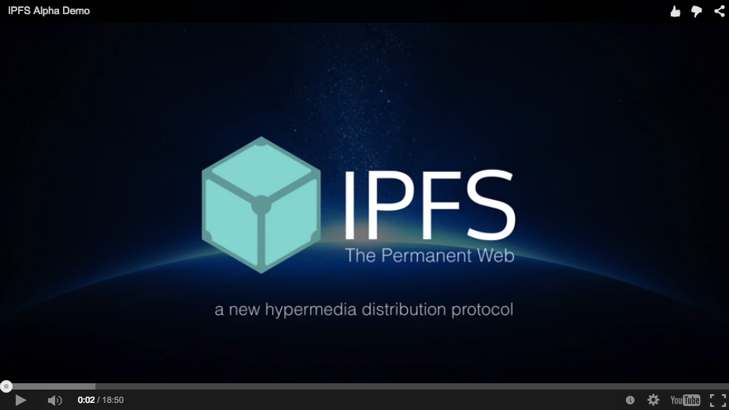

# IPFS是分布式Web [![explain]][source] [![translate-svg]][translate-list]

[explain]: http://llever.com/explain.svg
[source]: https://github.com/chinanf-boy/ipfs-tour
[translate-svg]: http://llever.com/translate.svg
[translate-list]: https://github.com/chinanf-boy/chinese-translate-list

> 一种点对点超媒体协议,使网络更快,更安全,更开放. 

欢迎来到IPFS!为什么不[观看视频演示](https://www.youtube.com/watch?v=8CMxDNuuAiQ)开始?请发布问题和想法<https://discuss.ipfs.io>

## 校对 ✅

<!-- doc-templite START generated -->
<!-- time = '2018 7.3' -->
<!-- repo = 'ipfs/ipfs' -->
<!-- commit = '26c0494a02e062f751928c9d423e5c64f2a183a7' -->
翻译的原文 | 与日期 | 最新更新 | 更多
---|---|---|---
[commit] | ⏰ 2018 7.3 | ![last] | [中文翻译][translate-list]

[last]: https://img.shields.io/github/last-commit/ipfs/ipfs.svg
[commit]: https://github.com/ipfs/ipfs/tree/26c0494a02e062f751928c9d423e5c64f2a183a7

<!-- doc-templite END generated -->

 info 

- ⏰ 2018 7.12 开始 [github source commit](https://github.com/ipfs/ipfs/tree/26c0494a02e062f751928c9d423e5c64f2a183a7)

- [x] [0. readme.md](./readme.md)
- [x] [1. contribute.md](./CONTRIBUTE.zh.md)
- [x] [2. endeavours-index.md](./ENDEAVOURS-INDEX.zh.md)
- [x] [3. implementation_status.md](./IMPLEMENTATION_STATUS.zh.md)
- [x] [4. roadmap-to-1.0.0.md](./ROADMAP-TO-1.0.0.zh.md)
- [x] [5. ./papers/readme.md](././papers/README.zh.md)

- ⏰ 2018 7.13 结束

[更多中文🇨🇳翻译](https://github.com/chinanf-boy/chinese-translate-list)

## 目录

<!-- START doctoc generated TOC please keep comment here to allow auto update -->
<!-- DON'T EDIT THIS SECTION, INSTEAD RE-RUN doctoc TO UPDATE -->

- [概观](#%E6%A6%82%E8%A7%82)
  - [快速摘要](#%E5%BF%AB%E9%80%9F%E6%91%98%E8%A6%81)
- [IPFS如何运作](#ipfs%E5%A6%82%E4%BD%95%E8%BF%90%E4%BD%9C)
  - [IPFS论文](#ipfs%E8%AE%BA%E6%96%87)
  - [IPFS会谈](#ipfs%E4%BC%9A%E8%B0%88)
- [更多关于IPFS](#%E6%9B%B4%E5%A4%9A%E5%85%B3%E4%BA%8Eipfs)
  - [IPFS的现状](#ipfs%E7%9A%84%E7%8E%B0%E7%8A%B6)
  - [Alpha分布](#alpha%E5%88%86%E5%B8%83)
  - [安全问题和披露](#%E5%AE%89%E5%85%A8%E9%97%AE%E9%A2%98%E5%92%8C%E6%8A%AB%E9%9C%B2)
- [项目和社区](#%E9%A1%B9%E7%9B%AE%E5%92%8C%E7%A4%BE%E5%8C%BA)
- [项目链接](#%E9%A1%B9%E7%9B%AE%E9%93%BE%E6%8E%A5)
  - [协议实现](#%E5%8D%8F%E8%AE%AE%E5%AE%9E%E7%8E%B0)
  - [API客户端库](#api%E5%AE%A2%E6%88%B7%E7%AB%AF%E5%BA%93)
  - [项目目录](#%E9%A1%B9%E7%9B%AE%E7%9B%AE%E5%BD%95)
    - [项目组织](#%E9%A1%B9%E7%9B%AE%E7%BB%84%E7%BB%87)
    - [得到帮助!](#%E5%BE%97%E5%88%B0%E5%B8%AE%E5%8A%A9)
    - [文件](#%E6%96%87%E4%BB%B6)
    - [讨论](#%E8%AE%A8%E8%AE%BA)
    - [规格讨论](#%E8%A7%84%E6%A0%BC%E8%AE%A8%E8%AE%BA)
    - [协议实现](#%E5%8D%8F%E8%AE%AE%E5%AE%9E%E7%8E%B0-1)
    - [API客户端实现](#api%E5%AE%A2%E6%88%B7%E7%AB%AF%E5%AE%9E%E7%8E%B0)
    - [IPFS GUI](#ipfs-gui)
    - [IPFS上的应用程序](#ipfs%E4%B8%8A%E7%9A%84%E5%BA%94%E7%94%A8%E7%A8%8B%E5%BA%8F)
    - [社区基础设施](#%E7%A4%BE%E5%8C%BA%E5%9F%BA%E7%A1%80%E8%AE%BE%E6%96%BD)
    - [参考清单](#%E5%8F%82%E8%80%83%E6%B8%85%E5%8D%95)
  - [其他社区资源](#%E5%85%B6%E4%BB%96%E7%A4%BE%E5%8C%BA%E8%B5%84%E6%BA%90)
    - [IPFS聚会](#ipfs%E8%81%9A%E4%BC%9A)
    - [工具](#%E5%B7%A5%E5%85%B7)
    - [Forks](#forks)
    - [实现子模块](#%E5%AE%9E%E7%8E%B0%E5%AD%90%E6%A8%A1%E5%9D%97)
- [执照](#%E6%89%A7%E7%85%A7)

<!-- END doctoc generated TOC please keep comment here to allow auto update -->

## 概观

IPFS ([星际文件系统](https://github.com/ipfs/faq/issues/76)) 是一种新的超媒体分发协议,由内容和身份定义地址. IPFS 支持创建完全分布式应用程序. 它旨在使网络更快,更安全,更开放. 

IPFS是一种分布式文件系统,旨在将所有计算设备与 **相同的** 文件系统连接起来. 在某些方面,这类似于Web的原始目标,但 IPFS 实际上更类似于交换 git对象 的单个 bittorrent 节点 . 您可以在论文中阅读有关其起源的 **白皮书**[IPFS  - 内容寻址,版本化,P2P文件系统](https://github.com/chinanf-boy/ipfs-tour#1-%E7%99%BD%E7%9A%AE%E4%B9%A6). 

IPFS正在成为互联网的一个新的主要子系统. 如果构建正确,它可以补充或替换HTTP. 它可以补充或替代更多. 听起来很疯狂. 没错它*是*疯狂的. 

想看更多?查看Juan Benet在Sourcegraph的演讲 -[IPFS: 永久网络](https://www.youtube.com/watch?v=Fa4pckodM9g). 

### 快速摘要

IPFS是一个协议: 

-   定义内容寻址文件系统
-   协调内容交付
-   结合 Kademlia + BitTorrent + Git

IPFS是一个文件系统: 

-   有目录和文件
-   可安装的文件系统 (通过FUSE) 

IPFS是一个网站: 

-   可用于查看Web等文档
-   可通过HTTP访问的文件`https://ipfs.io/<path>`
-   浏览器或扩展程序可以学习直接使用`ipfs://`网址或`dweb:/ipfs/`URI方案
-   哈希寻址内容保证真实性

IPFS是模块化的: 

-   任何网络协议上的连接层
-   路由层
-   使用路由层DHT (kademlia/coral) 
-   使用基于路径的命名服务
-   使用 bittorrent 启发的块交换

IPFS使用加密: 

-   加密哈希内容寻址
-   块级重复数据删除
-   文件完整性+版本控制
-   文件系统级加密+签名支持

IPFS是p2p: 

-   全球对等文件传输
-   完全分散的架构
-   **没有**中心点

IPFS是一个cdn: 

-   在本地向文件系统添加一个文件,它现在可供全世界使用
-   缓存友好 (内容哈希命名) 
-   基于bittorrent的带宽分配

IPFS有一个名称服务: 

-   IPNS,一个受 SFS 启发的名称系统
-   基于PKI的全局命名空间
-   有助于建立信任链
-   与其他 NSes 兼容
-   可以将 DNS, .onion, .bit 等映射到IPNS

## IPFS如何运作

要了解有关IPFS如何工作的更多信息,请查看[相关论文](#ipfs%E8%AE%BA%E6%96%87)要么[演讲](#ipfs%E4%BC%9A%E8%B0%88). 你也可以探索 ipfs[相关规范](https://github.com/ipfs/specs). 

### IPFS论文

-   白皮书[IPFS  - 内容寻址,版本化,P2P文件系统 (草案3) ](https://github.com/chinanf-boy/ipfs-tour#1-%E7%99%BD%E7%9A%AE%E4%B9%A6)
-   [产品规格](https://github.com/ipfs/specs) (工作正在进行中) 
-   也可以看看: <https://github.com/ipfs/papers>

### IPFS会谈

这是一个简短的介绍性会谈选择. 我们会在这里收集更多. 

-   2014-07-21  -[IPFS: 永久网络](https://www.youtube.com/watch?v=Fa4pckodM9g)在[Sourcegraph](https://sourcegraph.com/) (第一次公开演讲) 
-   2015-02-20  -[IPFS Alpha演示](https://www.youtube.com/watch?v=8CMxDNuuAiQ)
-   2015-06-03  -[IPFS动手介绍](https://www.youtube.com/watch?v=h73bd9b5pPA)在Ethereum SV Meetup
-   **2015-10-22  -[IPFS: 分布式永久Web](https://www.youtube.com/watch?v=HUVmypx9HGI)斯坦福大学研讨会 (项目最佳概述)**
-   2016-09-14  -[带IPFS的分布式应用程序](https://www.youtube.com/watch?v=jONZtXMu03w)
-   2016-10-22  -[分散网络,IPFS和Filecoin](https://www.youtube.com/watch?v=cU-n_m-snxQ)

## 更多关于IPFS

IPFS项目旨在发展互联网和网络的基础设施,我们从成功的系统中学到了很多东西,比如[git](https://git-scm.com/),[BitTorrent](http://bittorrent.org/),[Kademlia](https://en.wikipedia.org/wiki/Kademlia),[比特币](https://bitcoin.org/)还有很多很多. 这是在另一个时代 - 就像ARPA/DARPA/IETF/BellLabs 会产生的那种情况. IPFS是一个免费开源项目,有数百个贡献者. 

### IPFS的现状

**IPFS正在进行中!**

请注意,IPFS正在进行中. 这是一项雄心勃勃的计划,旨在让互联网更加自由,开放,安全,高效. 它建立在众多经过实战考验的分布式系统的好主意之上. 

今天,有一个主要的IPFS协议实现 (在[go-ipfs](https://github.com/ipfs/go-ipfs)) [更多的语言实现在路上](#%E5%8D%8F%E8%AE%AE%E5%AE%9E%E7%8E%B0) ([JavaScript](https://github.com/ipfs/js-ipfs),和[python](https://github.com/ipfs/py-ipfs)) . 

### Alpha分布

2015年2月,[go-ipfs](https://github.com/ipfs/go-ipfs)实现作为"Alpha分发"发布. 从那以后,go-ipfs一直在向Beta发布定期版本. 都[JS-ipfs](https://github.com/ipfs/js-ipfs)和[PY-ipfs](https://github.com/ipfs/py-ipfs)正在进行中. 

-   [安装IPFS Alpha Distribution](https://ipfs.io/docs/install)
-   [设置IPFS和入门](https://ipfs.io/docs/getting-started/)
-   [上网](https://ipfs.io/docs/getting-started/#going-online)
-   [更多例子](https://ipfs.io/docs/examples/)

有关深入的教程,请参阅a[动手介绍](https://www.youtube.com/watch?v=h73bd9b5pPA). 

### 安全问题和披露

IPFS协议及其实现仍处于重大发展阶段. 这意味着我们的协议可能存在问题,或者我们的实现可能存在错误. 而且 - 虽然IPFS还没有生产就绪 - 许多人已经在他们的机器上运行节点. 因此,我们非常重视安全漏洞. 如果您发现安全问题,请立即引起我们的注意!

如果您发现可能影响实时部署的漏洞 (例如,远程执行漏洞) ,请将您的报告私下发送至 **security@ipfs.io**. 请不要提交公共问题. 

如果问题是 无法立即利用的协议弱点 或尚未部署的问题,请公开讨论. 

## 项目和社区

IPFS项目现在非常庞大,我们社区有数百名贡献者. 你被邀请加入吧!以下是我们沟通渠道的一些链接: 

-   [IPFS社区论坛讨论和支持](https://discuss.ipfs.io)
-   [Sprint和项目管理](https://github.com/ipfs/pm)
-   [贡献指南](https://github.com/ipfs/community/blob/master/contributing.md)

您还可以找到我们的社区: 

-   IRC: [chat.freenode.net上的#ipfs](https://chat.ipfs.io)现场帮助和一些开发讨论 ([日志](https://botbot.me/freenode/ipfs/)) 
-   谷歌集团: [ipfs-users@groups.google.com](https://groups.google.com/forum/#!forum/ipfs-users) (低流量) 
-   推特: [@IPFSbot](https://twitter.com/ipfsbot)一些新闻. 

## 项目链接

IPFS项目很大 - 有许多子项目和相关工作. 我们将在这里记录核心文件,但你应该环顾四周. 这个空间正在爆炸,许多新项目一直在涌现. 

对于使用IPFS的社区策划的令人敬畏的项目列表,请查看[真棒,ipfs](https://github.com/ipfs/awesome-ipfs)!

### 协议实现

| 语言          | 项目                                  | 完整性    |
| ----------- | ----------------------------------- | ------ |
| Go           | <https://github.com/ipfs/go-ipfs>   | **参考** |
| JavaScript | <https://github.com/ipfs/js-ipfs>   | 残缺     |
| python          | <https://github.com/ipfs/py-ipfs>   | 开始     |
| C           | <https://github.com/Agorise/c-ipfs> | 开始     |

如果您想开始自己的IPFS语言实现,请查看[IPFS实现指南](https://github.com/ipfs/specs/blob/master/overviews/implement-ipfs.md),和[产品规格](https://github.com/ipfs/specs). 规范仍在不断发展,但核心格式是稳定的,可以构建. 如果您想开始努力,请确保发布问题,因为许多人表示有兴趣为新实现做出贡献. 

### API客户端库

| 语言            | 客户端库                                                | 完整性 |
| ------------- | --------------------------------------------------- | --- |
| Go             | <https://github.com/ipfs/go-ipfs-api>               |     |
| Java的         | <https://github.com/ipfs/java-ipfs-api>             |     |
| JavaScript   | <https://github.com/ipfs/js-ipfs-api>               |     |
| python            | <https://github.com/ipfs/py-ipfs-api>               |     |
| Scala           | <https://github.com/ipfs/scala-ipfs-api>            |     |
| Haskell          | <https://github.com/davidar/hs-ipfs-api>            |     |
| Swift            | <https://github.com/ipfs/swift-ipfs-api>            |     |
| CommonLisp    | <https://github.com/WeMeetAgain/cl-ipfs-api>        |     |
| Rust             | <https://github.com/ferristseng/rust-ipfs-api>      |     |
|               | <https://github.com/gkbrk/rust-ipfs-api>            |     |
|               | <https://github.com/rmnoff/rust-ipfs-api>           |     |
|               | <https://github.com/rschulman/rust-ipfs-api>        |     |
| ruby           | <https://github.com/Fryie/ipfs-ruby>                |     |
| Mac Automator | <https://github.com/NeoTeo/ipfs-osx-service>        |     |
| PHP           | <https://github.com/cloutier/php-ipfs-api>          |     |
|               | <https://github.com/digitalkaoz/php-ipfs-api>       |     |
| C#            | <https://github.com/TrekDev/net-ipfs-api>           |     |
|               | <https://github.com/richardschneider/net-ipfs-api>  |     |
| C ++          | <https://github.com/vasild/cpp-ipfs-api>            |     |
| Julia           | 联系: [@rened](https://github.com/rened)              | 0%  |
| Lua           | 联系: [@seclorum](https://github.com/seclorum)        | 0%  |
| Erlang           | <https://github.com/hendry19901990/erlang-ipfs-api> |     |
| Objective C.          | !                                                   | 0%  |

请通过贡献上述客户端库之一,来提供帮助. 如果您想创建另一个,请参阅[IPFS API客户端实现指南](https://github.com/ipfs/go-ipfs/blob/master/docs/implement-api-bindings.md),和[告诉我们](https://github.com/ipfs/ipfs/issues/83)所以我们可以帮忙!

### 项目目录

这旨在成为所有各种回购中的目录[IPFS Github组织](https://github.com/ipfs)和其他密切相关的事情. 

我们有一个状态板,可以检查所有IPFS存储库的CI,自述文件,测试覆盖率等,这里: <http://project-repos.ipfs.io/>

#### 项目组织

-   [ipfs](https://github.com/ipfs/ipfs)- 大师回购,介绍和新闻. 
-   [演讲](https://discuss.ipfs.io)- 社区讨论和支持论坛. 
-   [下午](https://github.com/ipfs/pm)- 社区冲刺和项目管理. 

#### 得到帮助!

寻求帮助的最佳地点是[IPFS社区论坛](https://discuss.ipfs.io)或者在IRC (freenode) 中`#ipfs`渠道. 

有两个已弃用的存储库包含[常问问题](https://github.com/ipfs/faq)和[支持](https://github.com/ipfs/support). 使用这些作为参考,但发布任何新的问题或请求帮助<https://discuss.ipfs.io>. 

#### 文件

-   [文件](https://github.com/ipfs/papers)- 关于IPFS的学术论文. 
-   [规范](https://github.com/ipfs/specs)-  IPFS协议规范. 
-   [笔记](https://github.com/ipfs/notes)- 各种相关的说明和讨论 (不适合其他地方) . 
-   [阅读清单](https://github.com/ipfs/reading-list)- 阅读论文以了解IPFS. 

#### 讨论

-   [应用](https://github.com/ipfs/apps)- 协调在ipfs之上编写应用程序. 
-   [档案](https://github.com/ipfs/archives)- 与IPFS协调档案工作. 
-   [在-网络浏览器](https://github.com/ipfs/in-web-browsers)- 协调将IPFS引入Web浏览器的工作. 

#### 规格讨论

- [archive-format](https://github.com/ipfs/archive-format)-  DAG存档格式. 
- [research-bitswap](https://github.com/ipfs/research-bitswap)-  Repo讨论Bitswap研究
- [bitswap-ml](https://github.com/ipfs/bitswap-ml)-  Bitswap和机器学习. 
- [research-crdt](https://github.com/ipfs/research-crdt)- 回购讨论crdt研究
- [research-pubsub](https://github.com/libp2p/research-pubsub)- 回购讨论pubsub研究
- [blockchain-data](https://github.com/ipfs/blockchain-data)- 使用IPFS存储区块链应用程序的数据. 
- [POST](https://github.com/ipfs/POST)- 人类通信的数据结构. 

#### 协议实现

-   [go-ipfs](https://github.com/ipfs/go-ipfs)- 在Go中实现. 
-   [js-ipfs](https://github.com/ipfs/js-ipfs)- 在Javascript中实现. 
-   [PY-ipfs](https://github.com/ipfs/py-ipfs)- 在Python中实现. 

#### API客户端实现

-   [http-api-spec](https://github.com/ipfs/http-api-spec)- 蜂房IPFS HTTP API描述<http://docs.ipfs.apiary.io>
-   [js-ipfs-api](https://github.com/ipfs/js-ipfs-api)- 在Javascript中实现. 
-   [java-ipfs-api](https://github.com/ipfs/java-ipfs-api)- 用Java实现. 
-   [go-ipfs-api](https://github.com/ipfs/go-ipfs-api)- 在Go中实现. 
-   [python-ipfs-apI](https://github.com/ipfs/python-ipfs-api)- 在Python中实现. 
-   [py-ipfs-api](https://github.com/ipfs/py-ipfs-api)- 用于IPFS API的python客户端库
-   [scala-ipfs-api](https://github.com/ipfs/scala-ipfs-api)- 在Scala中实现. 
-   [swift-ipfs-api](https://github.com/ipfs/swift-ipfs-api)- 在Swift中实现. 
-   [net-ipfs-apI](https://github.com/richardschneider/net-ipfs-api)- 在C#中实现. 

#### IPFS GUI

- [ipfs-companion](https://github.com/ipfs-shipyard/ipfs-companion)-  Web浏览器扩展
- [ipfs-desktop](https://github.com/ipfs-shipyard/ipfs-desktop)- 菜单栏/托盘桌面应用程序
- [ipfs-webui](https://github.com/ipfs/webui)-  IPFS WebUI应用程序
- [pm-ipfs-gui](https://github.com/ipfs-shipyard/pm-ipfs-gui)- 协调GUI应用程序的开发和维护

#### IPFS上的应用程序

-   [astralboot](https://github.com/ipfs/astralboot)- 直接从IPFS (TFTP,PXE Boot) 部署的低级引导服务器. 
-   [ipget](https://github.com/ipfs/ipget)-  wget for IPFS: 通过IPFS检索文件并在本地保存. 
-   [容器演示](https://github.com/ipfs/container-demos)- 演示如何从IPFS启动docker镜像和VM. 
-   [ipfs,geoip](https://github.com/ipfs/ipfs-geoip)- 通过ipfs进行Geoip. 
-   [npm在ipfs上](https://github.com/diasdavid/npm-on-ipfs)- 关于IPFS的npm. 

#### 社区基础设施

-   [博客](https://github.com/ipfs/blog)-  IPFS博客
-   [社区论坛](https://discuss.ipfs.io)
-   [分布](https://github.com/ipfs/distributions)- 用于构建/ install html页面的脚本. 
-   [基础设施](https://github.com/ipfs/infrastructure)- 社区的工具和系统. 
-   [通讯](https://github.com/ipfs/newsletter)- 准备和存储IPFS通讯综述
-   [OPS-请求](https://github.com/ipfs/ops-requests)- 有关基础设施运营的请求
-   [项目回购](https://github.com/ipfs/project-repos)CI状态和其他健康指标
-   [网站](https://github.com/ipfs/website)-  IPFS社区网站的来源<http://ipfs.io>. 

#### 参考清单

-   [裁判](https://github.com/ipfs/refs)- 用于发布IPFS引用列表的工具. 
-   [裁判-denylists,DMCA](https://github.com/ipfs/refs-denylists-dmca)- 针对IPFS公共网关的DMCA删除通知. 
-   [裁判-solarnet存储](https://github.com/ipfs/refs-solarnet-storage)- 在Solarnet存储主机上存档的内容清单. 

### 其他社区资源

-   [例子](https://github.com/ipfs/examples)- 关于如何使用go-ipfs的示例. 
-   [真棒,ipfs](https://github.com/ipfs/awesome-ipfs)- 有用的资源,用于使用IPFS并在其上构建内容. 
-   [ipfs,自述标准](https://github.com/RichardLitt/standard-readme)- 标准化所有IPFS Readme.md和其他markdown文件. 
-   [ipld-例子](https://github.com/ipfs/ipld-examples)- 与IPLD一起使用的数据结构示例,IPLD的新数据格式. 
-   [商标](https://github.com/ipfs/logo)-  IPFS的标志. 
-   [翻译项​​目](https://www.transifex.com/ipfs/ipfs/)-  IPFS WebUI和ipfs.io网站的众包翻译. 

#### IPFS聚会

-   [ipfs/里斯本](https://www.meetup.com/ipfs-lisbon-meetup/)- 里斯本的IPFS聚会. 
-   [ipfs/伦敦](https://www.meetup.com/IPFS-London-Meetup/)-  IPFS在伦敦举行的聚会. 
-   更多回购来到这里. 检查[社区讨论](https://github.com/ipfs/community/issues)其他聚会.  (现在有很多!) 

我们鼓励并支持IPFS Meetup,如果您想开始,请告诉我们. 随意组织自己[社区讨论](https://github.com/ipfs/community/issues)和[在主存储库中公布事件](https://github.com/ipfs/ipfs/issues). 

#### 工具

安装

- [install-go-ipfs](https://github.com/ipfs/install-go-ipfs)- 安装go-ipfs shell脚本. 
- [install-js-ipfs](https://github.com/ipfs/js-ipfs#install)- 通过npm或脚本标记安装js-ipfs. 
- [ipfs-update](https://github.com/ipfs/ipfs-update)-  IPFS的更新工具. 
- [fs-repo-migrations](https://github.com/ipfs/fs-repo-migrations)- 这些是迁移[IPFS fs-repo](https://github.com/ipfs/specs/tree/399c907b214a24dc82ca010af6884227cb2829cf/repo/fs-repo)版本. 
- [npm-go-ipfs](https://github.com/ipfs/npm-go-ipfs)- 从npm安装go-ipfs. 

其他

- [connections-globe](https://github.com/ipfs/connections-globe)- 用于查看所有IPFS对等方的交互式globe. 
- [dataviz](https://github.com/ipfs/dataviz)-  IPFS数据可视化. 
- [dir-index-html](https://github.com/ipfs/dir-index-html)- 目录列表html. 
- [dnslink-deploy](https://github.com/ipfs/dnslink-deploy)- 在Digital Ocean上自动设置DNS记录. 
- [file-browser](https://github.com/ipfs/file-browser)- 通用IPFS文件浏览器UI
- [fs-stress-test](https://github.com/ipfs/fs-stress-test)- 压力测试IPFS文件系统功能. 
- [js-ipfsd-ctl](https://github.com/ipfs/js-ipfsd-ctl)- 从JavaScript控制IPFS守护进程. 
- [ipfs-hubot](https://github.com/ipfs/ipfs-hubot)- 用于IPFS的Hubot. 
- [ipfs-blob-store](https://github.com/ipfs/ipfs-blob-store)- 购买blob的地方. 

#### Forks

-   [go-datastore (fork) ](https://github.com/ipfs/go-datastore)- 键值数据存储接口
-   [golang-build (fork) ](https://github.com/ipfs/golang-build)- 持续构建和发布基础架构
-   [pinbot-irc (fork) ](https://github.com/ipfs/pinbot-irc)- 用于ipfs irc频道的机器人,用于处理事物 (以及其他琐碎的任务) 

#### 实现子模块

还有更多,但我们会努力找到它们并在这里添加它们. 

- [go-blocks](https://github.com/ipfs/go-blocks)- 弃用,继续在go-ipfs内
- [go-commands](https://github.com/ipfs/go-commands)- 弃用,继续在go-ipfs内
- [go-ipfs-util](https://github.com/ipfs/go-ipfs-util)-  go-ipfs和其他相关go包使用的常用实用程序. 
- [go-ipld](https://github.com/ipfs/go-ipld)- 实现[IPLD规范](https://github.com/ipfs/specs/tree/master/merkledag/ipld.md)在Go. 
- [go-iprs](https://github.com/ipfs/go-iprs)-  Go-ipfs记录. 
- [go-libp2p](https://github.com/libp2p/go-libp2p)-  libp2p是一个网络堆栈和库模块化的IPFS项目,并单独捆绑供其他工具使用. 
- [go-log](https://github.com/ipfs/go-log)-  go-ipfs使用的日志库. 
- [js-ipfs](https://github.com/ipfs/js-ipfs)- 浏览器上的IPFS. 
- [js-ipfs-bitswap](https://github.com/ipfs/js-ipfs-bitswap)-  IPFS使用的Bitswap'数据交换'协议的JavaScript实现
(https://github.com/ipfs/js-ipfs-block-service)-  Block和BlockService的JavaScript实现
(https://github.com/ipfs/js-ipfs-unixfs-engine)-  IPFS使用的布局和分块机制的JavaScript实现
- [js-ipfs-repo](https://github.com/ipfs/js-ipfs-repo)- 实现[IPFS回购规范](https://github.com/ipfs/specs/tree/master/repo)在Javascript中. 
- [js-ipfs-unixfs](https://github.com/ipfs/js-ipfs-unixfs)-  IPFS'unixfs (MerkleDAG顶部的Unix文件系统表示) 的JavaScript实现. 
- [js-libp2p](https://github.com/libp2p/js-libp2p)- 在JavaScript中实现libp2p. 

## 执照

MIT
